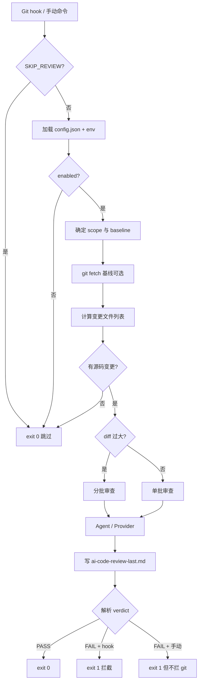

# AI Code Review 架构说明

本文描述系统模块划分、数据流与关键设计决策，便于理解「为什么 push 会被拦 / 报告从哪来」。

---

## 1. 总体架构

```
┌─────────────────────────────────────────────────────────────┐
│  Cursor / VS Code 扩展 (cursor-pre-push-vscode)              │
│  · 启用/禁用 · 写 config/prompt · 装 Git hook               │
│  · 手动运行审查 · Webview 报告 · SecretStorage API Key      │
└──────────────────────────┬──────────────────────────────────┘
                           │ 调用内置 CLI
                           ▼
┌─────────────────────────────────────────────────────────────┐
│  审查引擎 CLI (cursor-pre-push-review / ai-code-review)      │
│  · 读 config + env · 算 git diff · 拼 prompt                │
│  · 调 Agent 或 Provider · 解析 verdict · 写报告             │
└──────────────────────────┬──────────────────────────────────┘
                           │
          ┌────────────────┼────────────────┐
          ▼                ▼                ▼
   Cursor Agent      Claude Code      HTTP Provider
   (agent CLI)        (claude CLI)    (DeepSeek/MiniMax/OpenAI)
```

**设计原则**：

- CLI 与扩展解耦：Git hook 只依赖 `hook.sh` + 内置 `ai-code-review`，不依赖 IDE 进程
- **fail-closed**：hook 模式（`AI_CODE_REVIEW_FROM_HOOK=1`）下，无法判定、进程异常、配置错误默认拦截
- **手动审查不阻断**：`ai-code-review review` 或扩展「运行审查」不设 `FROM_HOOK`，FAIL 只告警

---

## 2. 仓库内模块

### 2.1 `cursor-pre-push-review`（CLI）

| 文件 | 职责 |
| --- | --- |
| `cli.ts` | 入口：`run` / `review`，解析 `--scope`，delete push 跳过 |
| `config.ts` | 加载 `config.json`，合并环境变量，解析 enabled/hooks/provider |
| `git.ts` | merge-base、diff 统计、分批、过滤不可审路径 |
| `prompt.ts` | 默认审查指令、自定义 prompt 拼接、verdict 说明自动追加 |
| `reviewer.ts` | 主流程：fetch 基线 → 算 diff → Agent/Provider → 判定 |
| `provider.ts` | HTTP 调用 DeepSeek / MiniMax / OpenAI 兼容 API |
| `verdict.ts` | 解析 `AI_CODE_REVIEW_VERDICT: PASS|FAIL`，识别配额/鉴权错误 |
| `report.ts` | 生成 `.cursor/ai-code-review-last.md`，终端失败块输出 |
| `repo.ts` | 查找 git 仓库根目录 |
| `pathSafety.ts` | 未跟踪文件路径安全校验 |

### 2.2 `cursor-pre-push-vscode`（扩展）

| 目录/文件 | 职责 |
| --- | --- |
| `commands/` | 启用、禁用、运行审查、报告、API Key、Prompt 管理 |
| `infrastructure/hookInstaller.ts` | 向 `.husky/*` 或 `.git/hooks/*` 写入标记块 |
| `infrastructure/hookRunner.ts` | 生成 `.cursor/ai-code-review/hook.sh` |
| `infrastructure/cliRunner.ts` | 扩展内调用 CLI，注入环境变量 |
| `settings/settingsProvider.ts` | 读写 `config.json`，生成 `ai-code-review.说明.md` |
| `views/reportWebview.ts` | 报告 Webview 展示 |
| `schemas/ai-code-review.schema.json` | config.json 中文 Schema 提示 |

---

## 3. 审查流程（详细）



### 3.1 Diff 范围

| scope | Git 命令语义 |
| --- | --- |
| `branch` | `merge-base(HEAD, baseline)..HEAD` |
| `staged` | `git diff --cached` |
| `uncommitted` | `git diff HEAD` + 安全未跟踪文件 |

### 3.2 基线解析（`baseline: auto`）

按顺序探测远程引用是否存在：

1. `origin/stable`
2. `origin/dev`
3. `origin/main`
4. `origin/master`

用户也可写死如 `origin/main`。

### 3.3 分批审查

触发条件（满足其一）：

- 总 diff 字符数 > `AI_CODE_REVIEW_MAX_DIFF_CHARS`（默认 120000）
- 完整 diff 读取失败（超过 git maxBuffer）

每批独立调用 AI，汇总 verdict：**任一批 FAIL → 整体 FAIL**。

---

## 4. AI 后端

### 4.1 Cursor Agent

```text
agent -p --trust --force --mode=ask --workspace <repo> --output-format text <prompt>
```

只读 Ask 模式，不修改工作区。

### 4.2 Claude Code

```text
claude -p --output-format text --permission-mode plan --no-session-persistence --tools ""
```

prompt 通过 stdin 传入。

### 4.3 Provider（HTTP）

- 读取 `AI_CODE_REVIEW_API_KEY`（来自 `.cursor/ai-code-review/env` 或扩展注入）
- `baseUrl` + `path` 拼接请求地址
- 自定义 `baseUrl` 需在白名单内，或设 `AI_CODE_REVIEW_ALLOW_CUSTOM_PROVIDER_URL=1`

---

## 5. 判定逻辑（Verdict）

AI 必须在输出**末尾**单独一行：

```text
AI_CODE_REVIEW_VERDICT: PASS
```

或

```text
AI_CODE_REVIEW_VERDICT: FAIL
```

解析规则：取**最后一次**出现的 verdict 行。

| 情况 | hook 模式行为 |
| --- | --- |
| PASS | 放行 |
| FAIL | 拦截（除非 `AI_CODE_REVIEW_ALLOW_ISSUES=1`） |
| 无 verdict + 配额/网络错误 | 拦截，提示基础设施问题 |
| 无 verdict + 其他 | 拦截（`VERDICT_LOOSE=1` 可放宽） |
| Agent 进程异常 | 拦截（`SOFT_CLI=1` 可放宽） |

---

## 6. Git Hook 安装机制

Hook 片段由 shell 执行：

1. 检查 `SKIP_REVIEW`
2. 检查 `config.json` 是否存在（不存在则**跳过**，不拦 push）
3. 执行 `.cursor/ai-code-review/hook.sh run --scope <按 hook 类型>`

标记块边界：

```sh
# >>> ai-code-review
…
# <<< ai-code-review
```

扩展升级时会自动把旧版片段刷新到新模板；v1.0 遗留的 `# >>> cursor-pre-push-review` 块会在激活时清理。

---

## 7. 配置优先级

```
环境变量 > .cursor/ai-code-review/config.json > 内置默认值
```

扩展 **Cursor 设置** 仅在**首次启用前**用于生成初始 `config.json`；之后以工作区 json 为准。

Provider API Key：

- 扩展手动审查 → SecretStorage + 运行时注入
- Git hook → 必须写入 `.cursor/ai-code-review/env`

---

## 8. 工作区文件与 Git

以下路径由扩展生成，默认加入 `.gitignore`：

- `.cursor/ai-code-review/`（含 config、env、hook.sh）
- `.cursor/ai-code-review.说明.md`
- `.cursor/ai-code-review-last.md`

**团队建议**：每人本机启用审查；`config.json` 模板可提交到文档或内部 wiki，但不要提交含 API Key 的 `env`。

---

## 9. 安全相关

- Agent 使用 `--mode=ask` / Claude `plan` 模式，限制写操作
- Provider 自定义 URL 有白名单校验
- 未跟踪文件 diff 前做路径安全校验（`pathSafety.ts`）
- `env` 含密钥，已 gitignore
